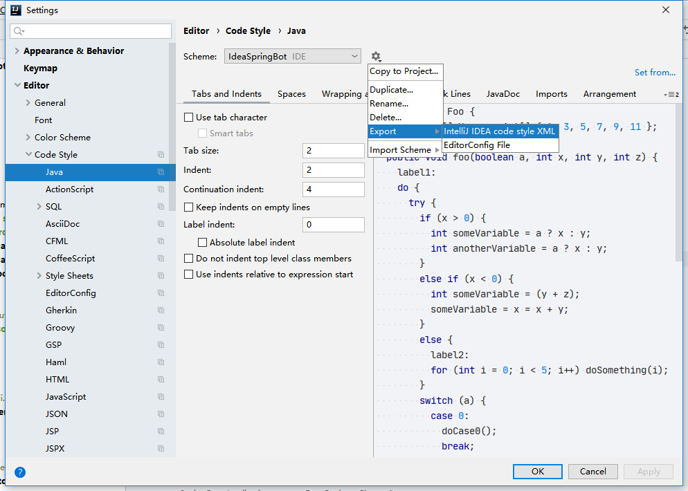

# Operation Instructions

## Create new repository

create a new repository from open source

click the **import a repository ** 

input repository's URL you need, and you can see [zookeeper](https://github.com/apache/zookeeper)as an example

repository naming: **name of source project-read** (example: zookeeper-read)

waiting your import is done

## Create branch

- branch naming: **source-hot-name of source branch** , example: source-hot-release-3.6.0

## Package path

- start package path with **`org.sourcehot`**

## Son project

- start son project's path with **source-hot**

##  Code style

- format your code style if you have code style file

  - example: there is code style xml in SpringBoot project 

    

    you can set code style in IDEA as following

    

- creator needs to create a style template if there is no existing code style file

  export from IDEA

  

  - put exported file into **codestyle** folder

