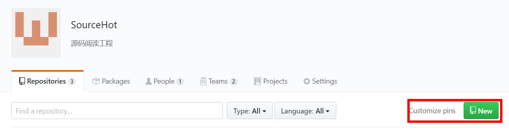
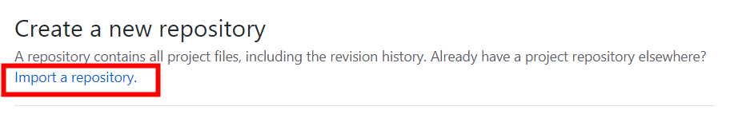
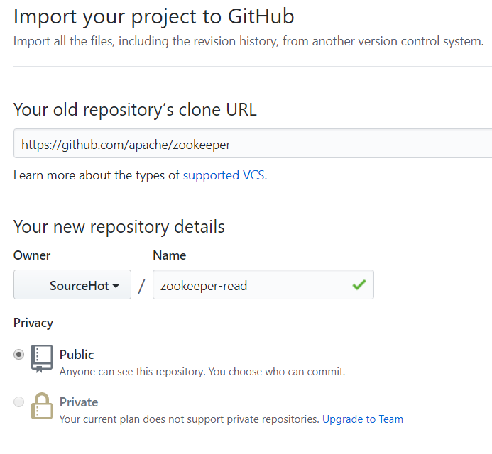
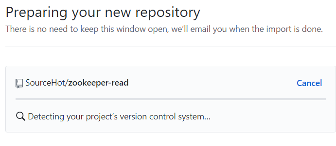
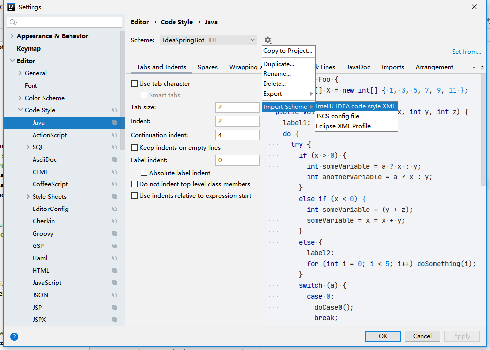
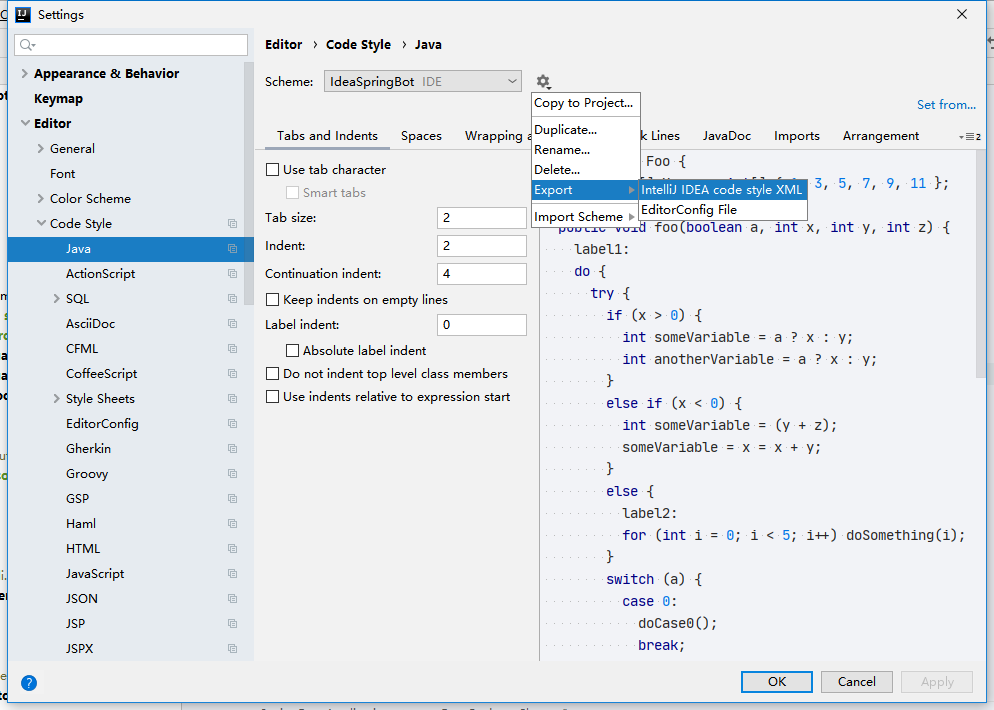

# 操作说明

## 仓库创建

在开源组织中创建新仓库

选择**import a repository ** 从官方的仓库中进行导入

比如我需要导入[zookeeper](https://github.com/apache/zookeeper)仓库将这个仓库url放入下面的输入框

仓库命名规则: **源项目名-read**

后续等待导入完成即可

## 分支创建

- 分支命名规则: **source-hot-源分支名称**

## 包路径

- 包路径以**`org.sourcehot`**开始

## 子工程

- 子工程以**source-hot**开始

## 代码格式

- 如果存在代码格式文件请使用代码格式文件进行统一格式化

  - 例: SpringBoot项目中有一个格式化文件

    

    应在IDEA中设置CodeStyle

    

- 如果没有格式化文件请创建仓库人员生成**代码格式化规则**文件

  IDEA中导出

  

  - 将导出文件放在**codestyle**文件夹中

